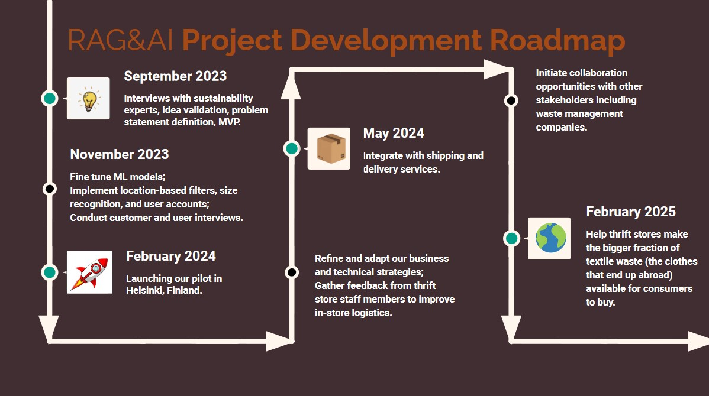

# RAGAI

- [Project summary](#project-summary)
  - [The issue we are hoping to solve](#the-issue-we-are-hoping-to-solve)
  - [How our technology solution can help](#how-our-technology-solution-can-help)
  - [Our idea](#our-idea)
- [Technology implementation](#technology-implementation)
  - [IBM AI service(s) used](#ibm-ai-services-used)
  - [Other IBM technology used](#other-ibm-technology-used)
  - [Solution architecture](#solution-architecture)
- [Presentation materials](#presentation-materials)
  - [Solution demo video](#solution-demo-video)
  - [Project development roadmap](#project-development-roadmap)
- [Additional details](#additional-details)
  - [How to run the project](#how-to-run-the-project)
  - [Live demo](#live-demo)
- [About this template](#about-this-template)
  - [Contributing](#contributing)
  - [Versioning](#versioning)
  - [Authors](#authors)
  - [License](#license)
  - [Acknowledgments](#acknowledgments)

_INSTRUCTIONS: Complete all required deliverable sections below._

## Project summary

### The issue we are hoping to solve

RAG&AI tackles the rising issue of textile waste driven by fast fashion, where perfectly usable clothes are discarded prematurely. While thrift stores play a role in mitigating this issue, they can't efficiently display all donated clothes on the shop floor, leading to an untraceable supply chain for the excess. RAG&AI addresses this problem by digitizing thrift store inventories and using machine learning to help consumers easily find second-hand garments, making sustainable fashion options more accessible and reducing the environmental impact of clothing waste.

### How our technology solution can help

RAG&AI: Reducing waste, making sustainable fashion accessible through technology innovation.

### Our idea

The fashion industry's rapid evolution, characterized by fast fashion and excessive clothing production, has led to a substantial textile waste problem. Perfectly wearable garments are being discarded prematurely, exacerbating environmental issues. While thrift stores play a crucial role in mitigating this problem, they often struggle to efficiently manage donated clothing, leading to a complex and untraceable supply chain for surplus items.
 
The fashion industry's relentless production and disposal of perfectly good clothing have resulted in a critical environmental issue. Textile waste is one of the fastest-growing waste streams globally, contributing significantly to landfills and pollution. This is where RAG&AI steps in.
 
RAG&AI presents an innovative solution to address textile waste and revolutionize sustainable fashion access. At its core, it's a user-friendly platform bridging the gap between thrift stores and eco-conscious consumers.
 
Here's how it works:
1. 	Digital Inventory: Thrift stores create a digital inventory by photographing garments. These images undergo machine learning analysis on IBM WatsonML, generating descriptive tags for efficient searching. RAG&AI's prompt lab ensures relevant tags, enhancing search accuracy.
2. 	User-Added Tags: Thrift stores can include their own tags for additional information and context, improving the data available to consumers.
3. 	Effortless Search and Reservations: Garments are showcased on RAG&AI's website, with an advanced image similarity model for easy searching. It arranges items from most to least similar, enabling users to find what they want quickly. Once they locate the perfect item at a nearby thrift store, they can reserve it for pickup within 24 hours.
 
RAG&AI's solution offers substantial benefits over traditional methods:
1. 	Efficiency: RAG&AI streamlines connecting thrift stores and consumers, displaying the entire inventory and reducing the waste from unprocessed donations.
2. 	Accessibility: RAG&AI challenges the notion that sustainable fashion is expensive, making eco-friendly options accessible and affordable.
3. 	User-Friendly Interface: The platform mimics popular fast fashion websites, making searching for preferred garments easy.
4. 	Environmental Impact: RAG&AI encourages garment reuse, reducing the environmental impact of clothing waste.
5. 	Community Engagement: RAG&AI connects consumers with local thrift stores, promoting local businesses and community involvement.
6. 	Empowering local businesses: By displaying thrifts stores garments on RAG&AI website, we increase their sales and support the local economy.
As textile waste continues to be a global issue, RAG&AI aims to expand and align with the 2025 EU regulation on post-consumer textile collection. With positive feedback, we plan to add features like location-based searches, sizing, user login, in-store logistics, and online shipping.
In conclusion, RAG&AI's technology is at the forefront of reducing textile waste, making sustainable fashion accessible, and creating a more eco-friendly fashion industry. It envisions a future where affordability and eco-conscious choices coexist.

More detail is available in our [description document](./docs/DESCRIPTION.md).

## Technology implementation

### IBM AI service(s) used

_INSTRUCTIONS: Included here is a list of commonly used IBM AI services. Remove any services you did not use, or add others from the linked catalog not already listed here. Leave only those included in your solution code. Provide details on where and how you used each IBM AI service to help judges review your implementation. Remove these instructions._

#### Watsonx.ai prompt lab
We used flan-ul2 hosted on Watsonx.ai in order to clean tags generated by the google cloud vision api. flan-ul2 then generates proper tags describing garments and gives the user an item description.

### Other IBM technology used

We used IBM Cloud Object Storage to store pictures taken by users. 

### Solution architecture

Diagram and step-by-step description of the flow of our solution:

![Solution Architecture]

1. The user navigates to the site and uploads a video file.
2. Watson Speech to Text processes the audio and extracts the text.
3. Watson Translation (optionally) can translate the text to the desired language.
4. The app stores the translated text as a document within Object Storage.

## Presentation materials

_INSTRUCTIONS: The following deliverables should be officially posted to your My Team > Submissions section of the [Call for Code Global Challenge resources site](https://cfc-prod.skillsnetwork.site/), but you can also include them here for completeness. Replace the examples seen here with your own deliverable links._

### Solution demo video

### Project development roadmap

We have built a mobile application using React Native that allows thrift shop owners to digitize their inventory by:

- Allowing them to store pictures of their garments on IBM Cloud Object Storage ;
- Creating a description and a list of features for each item they took a picture of, using Google’s Cloud Vision API and the flan-ul2 LLM hosted on Watsonx.ai; 
- Allowing them to visualize in the app their inventory, by displaying the pictures of their garments and their description.

In the future we plan to put the code we built for the garment similarity search feature into an API, giving the abilities to users to find similar clothes buyable in thrift shops to the ones they find on fast fashion websites. 

See below for our proposed schedule on next steps after the Call for Code 2023 submission.

## Additional details

_INSTRUCTIONS: The following deliverables are suggested, but **optional**. Additional details like this can help the judges better review your solution. Remove any sections you are not using._

### How to run the project

INSTRUCTIONS: In this section you add the instructions to run your project on your local machine for development and testing purposes. You can also add instructions on how to deploy the project in production.

### Live demo

You can find a running system to test at: 

---

_INSTRUCTIONS: You can remove the below section from your specific project README._

## About this template

### Authors

### License

This project is licensed under the Apache 2 License - see the [LICENSE](LICENSE) file for details.

### Acknowledgments

- Based on [Billie Thompson's README template](https://gist.github.com/PurpleBooth/109311bb0361f32d87a2).

The project currently does the following things.

- Feature 1
- Feature 2
- Feature 3

In the future we plan to...

See below for our proposed schedule on next steps after Call for Code 2023 submission.

## Additional details

_INSTRUCTIONS: The following deliverables are suggested, but **optional**. Additional details like this can help the judges better review your solution. Remove any sections you are not using._

### How to run the project

INSTRUCTIONS: In this section you add the instructions to run your project on your local machine for development and testing purposes. You can also add instructions on how to deploy the project in production.

### Live demo

You can find a running system to test at...

See our [description document](./docs/DESCRIPTION.md) for log in credentials.

---

_INSTRUCTIONS: You can remove the below section from your specific project README._

## About this template

### Contributing

Please read [CONTRIBUTING.md](CONTRIBUTING.md) for details on our code of conduct, and the process for submitting pull requests to us.

### Versioning

We use [SemVer](http://semver.org/) for versioning. For the versions available, see the [tags on this repository](https://github.com/your/project/tags).

### Authors

- **Billie Thompson** - _Initial work_ - [PurpleBooth](https://github.com/PurpleBooth)

### License

This project is licensed under the Apache 2 License - see the [LICENSE](LICENSE) file for details.

### Acknowledgments

- Based on [Billie Thompson's README template](https://gist.github.com/PurpleBooth/109311bb0361f32d87a2).
